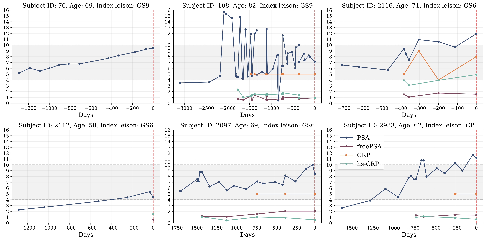

# Multimodal Data Fusion with Irregular PSA Kinetics for Automated Prostate Cancer Grading

A deep learning framework that combines MRI imaging data with longitudinal patient information, including irregular PSA measurements, for improved prostate cancer detection and grading.


*Overall architecture of our multimodal fusion framework for prostate cancer detection.*

## Overview

This repository contains the implementation of a multimodal fusion framework that:
- Processes multiparametric MRI data using a modified nnUNet architecture
- Handles irregular PSA measurements through a Multi-Time Attention Module (mTAN)
- Combines imaging and clinical data using advanced fusion strategies
- Achieves superior performance in detecting clinically significant prostate cancer

## Key Features

- **MRI Processing**: Modified 3D nnUNet for handling anisotropic prostate MRI data
- **Temporal Modeling**: mTAN module for processing irregular PSA measurements
- **Multimodal Fusion**: Implementation of FC-CAT-FC and DAFT fusion strategies
- **Zonal Analysis**: Integration of prostate zone segmentation data
- **Clinical Integration**: Handling of various clinical parameters (PSA, freePSA, CRP, etc.)

## Performance Highlights

- Internal Dataset (630 cases):
  - AUC: 0.843 (vs 0.808 for image-only)
  - Improved sensitivity (74.5% vs 62.2%) at matched specificity (76.5%)
  
- External Dataset (419 cases):
  - AUC: 0.765
  - Robust performance across 160 different MRI devices


## Model Architecture

The framework consists of three main components:
1. nnUNet-Encoder backbone for MRI processing
2. mTAN module for handling irregular PSA measurements
3. Fusion module (FC-CAT-FC/DAFT) for multimodal integration

### Temporal Data Processing

*Examples of irregular PSA and biomarker time series showing sampling variability and available measurements.*

### Performance Analysis


*Performance comparison of multimodal and baseline models against radiological assessment on internal and external test datasets.*


<!-- ## Citation

If you use this code in your research, please cite our paper:

```bibtex
Need to wait for pre-print publishing 
``` -->

## Contact

For questions and feedback, please contact:\
Oleksii Bashkanov (oleksii.bashkanov@ovgu.de)